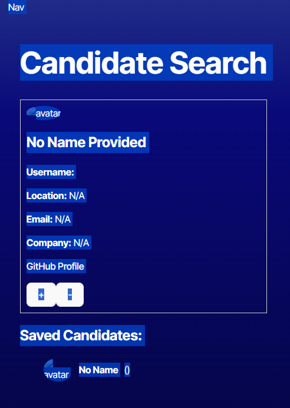

# Candidate Search App 🚀

A TypeScript-powered candidate search application that integrates with the GitHub API to find and manage potential candidates for hiring.

 <!-- Replace with your actual screenshot file path -->

---

## 📚 Description

This app allows employers to browse and save potential candidates by retrieving data from the GitHub API. Built with **React** and **TypeScript**, it ensures type safety and a smooth user experience.

Key features:
- Displays detailed information for GitHub users.
- Lets you accept (`+`) or reject (`-`) a candidate.
- Saves accepted candidates to **local storage**.
- Persists data even when the page reloads.
- Clean, intuitive interface that closely matches the provided mock-ups.

---

## 💻 Technologies Used

- **React** (with Vite)
- **TypeScript** (for type safety and better developer experience)
- **GitHub API** (REST endpoints for users)
- **Local Storage** (for persisting saved candidates)
- **Render** (for deployment)

---

## 🏗️ Getting Started

### 1️⃣ Clone the repository

```bash
git clone https://github.com/your-username/candidate-search.git
cd candidate-search
```

### 2️⃣ Install dependencies
npm install

### 3️⃣ Configure environment variables
Create a .env file in the root directory and add your GitHub Personal Access Token:
VITE_GITHUB_TOKEN=your_github_token_here
⚠️ Important: Do not share this token publicly!

### 4️⃣ Start the development server
npm run dev

## 🔎 Usage
- When the app loads, it displays the first candidate.
- Use the + button to save a candidate and move to the next one.
- Use the - button to skip the current candidate.
- Saved candidates appear in a separate section at the bottom of the page.
- Reloading the page will preserve the saved candidates list.

## 🌐 Deployment
This application is deployed on Render and accessible via this live link:
👉 Live App: https://your-deployment-url.render.com
👉 Repository: https://github.com/jcalderaro-96/UCI-Module-13-CandidateSearch

## 🎯 User Story
AS AN employer
I WANT a candidate search application
SO THAT I can hire the best candidates

## ✅ Acceptance Criteria
- Displays information for a candidate, including name, username, location, avatar, email, html_url, and company.
- + button: saves the candidate and moves to the next one.
- - button: skips the candidate.
- Displays a list of saved candidates.
- Data persists on page reload using local storage.
- Handles no more candidates / no saved candidates scenarios with appropriate messages.

## 📊 Grading Criteria (Bootcamp Challenge)
- ✅ Uses GitHub API to retrieve user data.
- ✅ Uses an interface to type user data (User interface in TypeScript).
- ✅ Stores potential candidates in local storage.
- ✅ Deployed to a live URL.
- ✅ Loads with no errors.
- ✅ Intuitive and clean UI that matches the provided mock-up.
- ✅ Follows best practices for file structure, naming conventions, and commit history.
- ✅ Includes a README file with description, screenshot, and deployed link.

## 🔥 Bonus Features
- ✅ Sorting and filtering of potential candidates (if implemented).

## 🤝 Contributing
Have ideas for improvements? Feel free to open an issue or submit a pull request!

📸 Screenshot
Here’s what the app looks like:
 <!-- Replace with your actual screenshot file path -->

## 📝 License
This project is licensed under the MIT License.

## 🤝 Credits & Acknowledgements
This project was built through collaboration between myself and ChatGPT by OpenAI, who provided valuable insights, technical guidance, and best practices throughout the development process. Their support helped ensure the app met the challenge requirements and achieved a polished, professional finish.

Enjoy! 🚀
 
